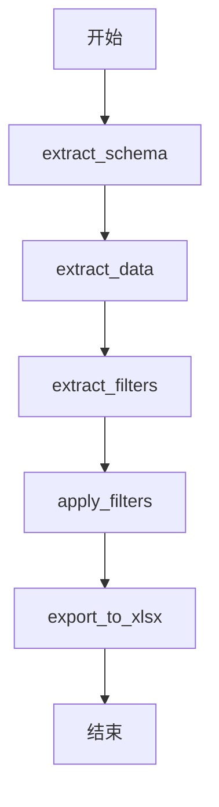

# XLSX 处理流程

## 1. 数据提取阶段
- **extract_schema**: 提取表结构（预留功能）
- **extract_data**: 从Excel的"总表"Sheet中提取数据
- **extract_filters**: 从Excel的"总表筛选"Sheet中提取筛选条件

## 2. 数据处理阶段
- **apply_filters**: 应用筛选条件生成多个CSV文件

## 3. 结果输出阶段
- **export_to_xlsx**: 生成包含所有结果的XLSX文件

## 流程图


## 目标
将输入的 XLSX 文件拆分为多个中间文件（CSV 或对象），根据筛选标签生成新的 XLSX 文件。

## 流程步骤

### 1. 主函数设计
- **功能**：协调整个流程，调用子模块。
- **输入**：原始 XLSX 文件路径。
- **输出**：生成的新 XLSX 文件。

### 2. 拆分 XLSX
- **表结构提取**：
  - 从指定 Sheet 或列中提取列名、数据类型等元信息。
  - 保存为 `schema.csv`。
- **数据总表提取**：
  - 提取原始数据到 `data.csv`。
- **筛选标签提取**：
  - 从用户指定的 Sheet 或列中提取筛选条件，保存为 `filters.csv`。

### 3. 筛选任务
- **逻辑**：
  - 读取 `filters.csv`，解析筛选条件（如 `column_name=value` 或范围条件）。
  - 对 `data.csv` 应用筛选，生成 `filtered_data.csv`。

### 4. 生成新 XLSX
- **逻辑**：
  - 将 `filtered_data.csv` 转换为 XLSX 文件。
  - 可选：合并多个 Sheet（如原始表结构、筛选结果）。

## 代码结构
```python
main.py                # 主函数入口
modules/
  ├── extract.py       # 拆分 XLSX
  ├── filter.py        # 筛选逻辑
  └── export.py        # 生成 XLSX
```

## 依赖库
- `pandas`：数据处理。
- `openpyxl`：XLSX 文件操作。

## 后续扩展
- 支持动态筛选条件组合。
- 添加日志和错误处理。